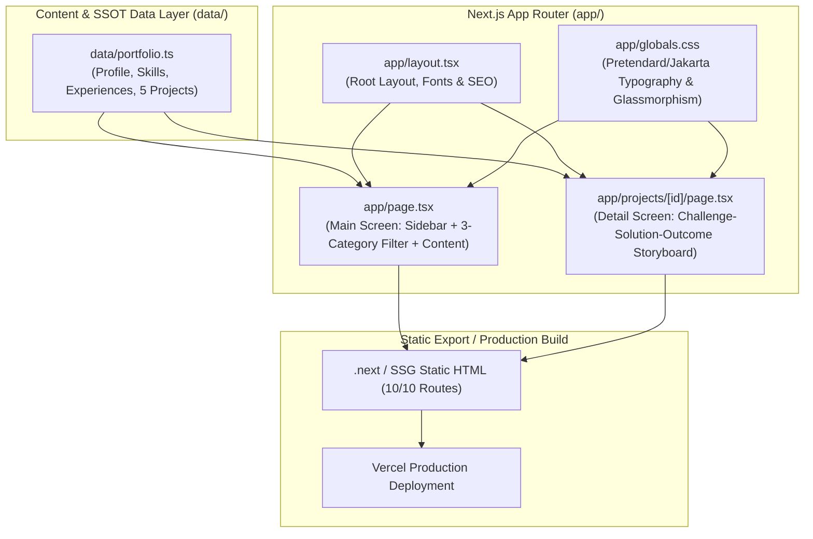

# Portfolio Website AI Guide

> 본 문서는 **Portfolio Website** 저장소의 Root AI 가이드(Tier 1)입니다.  
> 코드베이스 아키텍처, 작업 라우팅, 안전 게이트 및 **KJW Team 다중 서브에이전트 오케스트레이션** 규약을 정의합니다.

---

## 1. Start Here

- **문서의 성격**: 본 가이드는 변경 이력 보관소가 아닌 **실행 네비게이션 및 안전 통제 가이드**입니다.
- **Obsidian Wiki SSOT**:
  - `E1JEONG_HOME` (홈 PC): `C:\Users\sumas\OneDrive\Desktop\dev\10.obsidian\Dev\Project\Personal\portfolio`
  - `DESKTOP-PE3TPJN` (회사 PC): `C:\Users\Unionbiometrics\Desktop\dev\5.obsidian\Dev\Project\Personal\portfolio`
  - 머신별 상세 경로는 위키 `_meta/routing-tables.md`를 기준으로 해석합니다.
- **세션 진입 시 필수 열람 순서**:
  1. `README.md` (위키 홈 및 개요)
  2. `handoff.md` (직전 세션 현황 및 다음 시작점)
  3. `issues/needs-verification.md` (미해결 리스크 및 미확인 사실)
- **운영 모드 (단일 창구 원칙)**:
  - 사용자는 메인 에이전트(**은광 팀장**)에게만 지시를 전달합니다.
  - 은광은 작업을 분석하여 5명의 가상 팀원(`roles/*.md`)에게 작업을 위임하고, 결과를 통합하여 사용자에게 보고합니다.
- **보고 언어**: 대화 및 작업 보고는 **한국어**로 진행하며, 코드·식별자·명령어는 영문을 유지합니다.

---

## 2. Product and Runtime/Pipeline Map



---

## 3. Module/Domain Map and First Reads

| 도메인 / 영역 | 주 담당 경로 | 최초 진입 소스 | 서브모듈 가이드 (Tier 2) / 관련 위키 |
| :--- | :--- | :--- | :--- |
| **Content & Data** | `data/` | `data/portfolio.ts` | [`data/AGENTS.md`](file:///C:/Users/sumas/OneDrive/Desktop/dev/7.server/portflio-website/data/AGENTS.md)<br>• 위키: `content/content-model.md`, `content/career-hub-integration.md` |
| **Main Screen UI** | `app/` | `app/page.tsx` | [`app/AGENTS.md`](file:///C:/Users/sumas/OneDrive/Desktop/dev/7.server/portflio-website/app/AGENTS.md)<br>• 위키: `technical/code-structure.md` |
| **Project Detail UI** | `app/projects/[id]/` | `app/projects/[id]/page.tsx` | [`app/AGENTS.md`](file:///C:/Users/sumas/OneDrive/Desktop/dev/7.server/portflio-website/app/AGENTS.md)<br>• 위키: `technical/code-structure.md` |
| **Theme / Style / Font** | `app/` | `app/globals.css` | [`app/AGENTS.md`](file:///C:/Users/sumas/OneDrive/Desktop/dev/7.server/portflio-website/app/AGENTS.md)<br>• 위키: `technical/code-structure.md` |
| **Build & Config** | 루트 설정 | `package.json`, `next.config.ts` | • 위키: `operations/deployment.md` |
| **Team Orchestration** | `roles/` | `roles/eungwang.md` | • 가상 팀원 역할 정의: `roles/*.md`<br>• 위키: `schema.md` § `## AI guides` |

---

## 4. Task Router

사용자 작업 요청 시 아래 매트릭스에 따라 우선 읽을 위키 문서와 소스 파일 진입점을 탐색합니다.

| 작업 요청 의도 (Intent) | 먼저 읽을 위키 문서 | 1차 수정 진입점 | 후속 추적 / 검증 경로 |
| :--- | :--- | :--- | :--- |
| **프로젝트/이력 데이터 수정** | `content/content-model.md`<br>`content/career-hub-integration.md` | `data/portfolio.ts` | `data/AGENTS.md` 준수 확인 ➔ `npm.cmd run build` (SSG 검증) |
| **메인 화면 UI/레이아웃 변경** | `technical/code-structure.md` | `app/page.tsx` | `app/AGENTS.md` 준수 확인 ➔ 3개 카테고리 필터 동작 확인 |
| **상세 페이지 스토리보드 개선** | `technical/code-structure.md` | `app/projects/[id]/page.tsx` | `data/portfolio.ts` `features`/`outcomes` 스키마 일치 확인 |
| **디자인/테마/폰트/CSS 조정** | `technical/code-structure.md` | `app/globals.css` | `app/layout.tsx` (폰트 변수) 및 글래스모피즘 렌더링 확인 |
| **배포/빌드/Next.js 환경 설정** | `operations/deployment.md` | `package.json`<br>`next.config.ts` | `npm.cmd run lint` ➔ `npm.cmd run build` |
| **신규 프로젝트 추가/순서 조정** | `content/content-model.md` | `data/portfolio.ts` | `app/page.tsx` 및 `app/projects/[id]/page.tsx` 동기화 |

---

## 5. Immutable Boundaries and Change Gates

작업 시 절대 위반해서는 안 되는 불변의 안전 규칙입니다.

| 항목 | 안전 규칙 및 위반 시 조치 |
| :--- | :--- |
| **Career-Hub SSOT 원칙** | • `Career-Hub`에서 검증되지 않은 수치나 대외비성 사실을 임의로 단정하여 기재 금지.<br>• 미확인 주장은 `issues/needs-verification.md`에 등록 후 정성적 표현으로 완화. |
| **데이터 분리 원칙** | • 정적 텍스트와 프로젝트 콘텐츠는 `app/` 컴포넌트에 하드코딩하지 않고 `data/portfolio.ts`에 집중 관리. |
| **SSG 빌드 무결성** | • 모든 동적 라우트(`app/projects/[id]`)는 정적 내보내기(`generateStaticParams` / SSG)가 가능해야 함.<br>• TypeScript 컴파일 및 린트 에러 무관용. |
| **5대 프로젝트 순서 보장** | • 프로젝트 순서는 1. UBio-N Face Pro ➔ 2. Fisher Lotto ➔ 3. SmartSet Renewal ➔ 4. SmartSet ➔ 5. 안티스푸핑 AI 순서를 유지. |
| **AI Guide 2-Tier 보존 (Anti-Regression)** | • 루트 `AGENTS.md`를 generic KJW Team 템플릿으로 통째로 덮어쓰는 행위 영구 금지.<br>• 7대 표준 섹션(`_meta/ai-guide-structure.md`)과 Tier 2 서브모듈 가이드(`app/AGENTS.md`, `data/AGENTS.md`) 구조를 보존.<br>• 팀 하네스/규칙 수정 시 전체를 덮어쓰지 않고 `Section 7` 또는 `roles/*.md` 파일만 부분 수정. |
| **비파괴적 수정 (Surgical)** | • 요청과 무관한 주변 코드 임의 리팩토링 금지. 기존 주석 및 인터페이스 보존. |

---

## 6. Build and Verification

작업 후 반드시 가장 작은 단위부터 빌드/검증 명령어를 실행합니다.

### Windows (PowerShell / CMD)
```powershell
# 의존성 설치 (필요 시)
npm.cmd install

# 개발 서버 실행 (로컬 확인: http://localhost:3000)
npm.cmd run dev

# 린트 검사
npm.cmd run lint

# 프로덕션 정적 빌드 및 SSG 검증 (10/10 routes 확인)
npm.cmd run build
```

### Linux / WSL / macOS (Bash)
```bash
npm install
npm run dev
npm run lint
npm run build
```

---

## 7. KJW Team Orchestration (Virtual Team Delegation)

본 저장소는 **단일 메인 에이전트(은광=팀장)** 가 5명의 가상 팀원을 서브에이전트로 위임 호출하는 구조를 지원합니다.

### 가상 팀 구성 및 역할 분담

| 이름 | 역할 | 역할 파일 | 기본 담당 영역 |
| :--- | :--- | :--- | :--- |
| **은광** | **팀장 (Main Agent)** — 지시 수령, 작업 배분, 결과 통합, 충돌 관리 | `roles/eungwang.md` | 총괄 오케스트레이션 및 사용자 보고 |
| **민혁** | **아키텍트** — 시스템 설계, 데이터 모델링, 마일스톤 분해 | `roles/minhyuk.md` | 아키텍처 설계, 위키 연계 검토 |
| **창섭** | **개발자** — 기능 구현, 컴포넌트 로직, TDD, 패키지 관리 | `roles/changseop.md` | `app/`, `data/`, `tests/` |
| **현식** | **UI/UX 디자이너** — 화면 설계, 레이아웃, Tailwind 스타일, 폰트 | `roles/hyunsik.md` | `app/globals.css`, UI 컴포넌트, `public/` |
| **프니엘** | **리서쳐** — 외부 자료 조사, 스펙 분석, `inputs/` 자료 분석 | `roles/phaniel.md` | `inputs/`, 위키 리서치 자료 |
| **성재** | **QA / 리뷰어** — 코드 리뷰, 빌드/린트 검증, 품질 검토 | `roles/seongjae.md` | 빌드 검증, `issues/needs-verification.md` |

### Triple Crown 요청 분류 및 실행 절차

요청 수령 시 즉시 0단계 분류를 선언합니다:
```text
📥 받은 요청: "{요청 원문}"
📏 규모 판정: {소|중|대|특대} — 근거: {짧은 이유}
🎯 워크플로우: {WF-DIRECT | WF-FEATURE-DEV | WF-HOTFIX | WF-TRIPLE-CROWN}
📋 적용 Phase: {적용 Phase 목록}
```

- **규모 판정 기준**:
  - **소 (1시간 이내)**: 1파일 수정, 설정 변경, 질문 ➔ `WF-DIRECT`
  - **중 (반나절)**: 버그 수정, 1모듈 기능 개선 ➔ `WF-FEATURE-DEV` 축약형
  - **대 (1~3일)**: 신규 기능 모듈, UI 전면 개편 ➔ `WF-FEATURE-DEV`
  - **특대 (1주 이상)**: 신규 서비스, 아키텍처 개편 ➔ `WF-TRIPLE-CROWN`

### 충돌 방지 안전 규칙 (R1 ~ R5)

1. **R1. 영역 분리 (Directory Ownership)**: 위임 프롬프트에 `작업 영역`과 `금지 영역`을 명시하여 물리적 파일 충돌 방지.
2. **R2. 브랜치 분리**: 복잡한 작업 시 `feature/{이름}-{기능}` 브랜치 활용.
3. **R3. 공유 파일 순차 처리**: `package.json`, `data/portfolio.ts` 등 공용 자원은 한 번에 한 팀원만 수정.
4. **R4. 의존성 통제**: `npm install` 등 패키지 변경은 창섭(개발자) 단독 위임 + 은광 사전 승인 필수.
5. **R5. 충돌 감지 및 검증 보고**: 위임 작업 완료 후 수정 파일 목록과 빌드/린트 통과 여부를 은광에게 필수 보고.

### 입력 자료(`inputs/`) 처리 절차
- 사용자가 제공하는 시안, 문서, 데이터는 `inputs/`에 배치합니다.
- `inputs/` 탐색 ➔ 자료 분석 발표 ➔ 적합한 팀원(현식/프니엘/창섭) 라우팅을 수행합니다.

### 세션 종료 프로토콜
- 작업 완료 시 반드시 빌드 검증(`npm.cmd run build`)을 통과한 후, Obsidian 위키 동기화(`obsidian-wiki-sync`)를 실행합니다.
