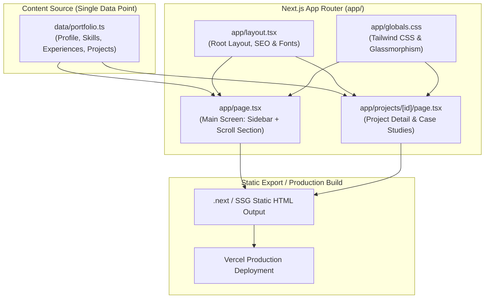

# Portfolio AI Guide

> Standard AI Guide for the Portfolio Website repository, integrating with the Obsidian Wiki SSOT and KJW Team Orchestration.
> Inherits [[../../5.obsidian/_meta/ai-guide-structure|Standard AI Guide Architecture]].

---

## 1. Start Here

- **Navigation Aid**: 본 문서는 개발/유지보수 시 진입점, 태스크 라우팅, 안전 가드레일, 빌드/검증 커맨드를 제공하는 실행 나침반입니다.
- **Authoritative Wiki SSOT**: 도메인 지식, 설계 배경, 의사결정 기록의 단일 진실 공급원은 Obsidian 위키입니다.
  - 위키 경로: `Dev/Project/Personal/portfolio` ([README](file:///C:/Users/Unionbiometrics/Desktop/dev/5.obsidian/Dev/Project/Personal/portfolio/README.md))
- **Mandatory Session Read Order**:
  1. `Dev/Project/Personal/portfolio/README.md` (위키 홈 및 프로젝트 목표)
  2. `Dev/Project/Personal/portfolio/handoff.md` (직전 세션 진행 상황 및 다음 작업)
  3. `Dev/Project/Personal/portfolio/issues/needs-verification.md` (미해결 과제 및 불확실성 항목)
- **Higher SSOT (Career-Hub)**: 커리어 이력 및 대외 공개 적합성의 상위 단일 진실 공급원은 `Career-Hub`입니다.
- **Report & Language**: 사용자 응답은 한국어로 간결하게 보고하며, 코드·식별자·명령어는 영문을 유지합니다.

---

## 2. Product and Runtime/Pipeline Map

Next.js App Router 기반의 정적 사이트 생성(SSG) 포트폴리오 웹사이트입니다.



---

## 3. Module/Domain Map and First Reads

| 도메인 / 영역 | 주 담당 경로 | 최초 진입 소스 | 관련 위키 문서 |
| :--- | :--- | :--- | :--- |
| **Content & Data** | `data/` | `data/portfolio.ts` | [content/content-model.md](file:///C:/Users/Unionbiometrics/Desktop/dev/5.obsidian/Dev/Project/Personal/portfolio/content/content-model.md)<br>[content/career-hub-integration.md](file:///C:/Users/Unionbiometrics/Desktop/dev/5.obsidian/Dev/Project/Personal/portfolio/content/career-hub-integration.md) |
| **Main Screen UI** | `app/` | `app/page.tsx` | [technical/code-structure.md](file:///C:/Users/Unionbiometrics/Desktop/dev/5.obsidian/Dev/Project/Personal/portfolio/technical/code-structure.md) |
| **Project Detail UI** | `app/projects/[id]/` | `app/projects/[id]/page.tsx` | [technical/code-structure.md](file:///C:/Users/Unionbiometrics/Desktop/dev/5.obsidian/Dev/Project/Personal/portfolio/technical/code-structure.md) |
| **Global Style / Theme** | `app/` | `app/globals.css` | [technical/code-structure.md](file:///C:/Users/Unionbiometrics/Desktop/dev/5.obsidian/Dev/Project/Personal/portfolio/technical/code-structure.md) |
| **Build & Deployment** | 루트 설정 | `package.json`, `next.config.ts` | [operations/deployment.md](file:///C:/Users/Unionbiometrics/Desktop/dev/5.obsidian/Dev/Project/Personal/portfolio/operations/deployment.md) |
| **Team Orchestration** | `roles/` | `roles/eungwang.md` | [schema.md](file:///C:/Users/Unionbiometrics/Desktop/dev/5.obsidian/Dev/Project/Personal/portfolio/schema.md) § `## AI guides` |

---

## 4. Task Router

사용자 작업 요청 시 아래 매트릭스에 따라 우선 읽을 위키 문서와 소스 파일 진입점을 탐색합니다.

| 작업 요청 의도 (Intent) | 먼저 읽을 위키 문서 | 1차 수정 진입점 | 후속 추적 / 검증 경로 |
| :--- | :--- | :--- | :--- |
| **프로젝트/이력 데이터 수정** | [content/content-model.md](file:///C:/Users/Unionbiometrics/Desktop/dev/5.obsidian/Dev/Project/Personal/portfolio/content/content-model.md)<br>[content/career-hub-integration.md](file:///C:/Users/Unionbiometrics/Desktop/dev/5.obsidian/Dev/Project/Personal/portfolio/content/career-hub-integration.md) | `data/portfolio.ts` | `npm run build`로 SSG 페이지 생성 확인 |
| **메인 화면 UI/레이아웃 변경** | [technical/code-structure.md](file:///C:/Users/Unionbiometrics/Desktop/dev/5.obsidian/Dev/Project/Personal/portfolio/technical/code-structure.md) | `app/page.tsx` | `app/globals.css` 스타일 및 반응형 스크롤 확인 |
| **상세 페이지 스토리보드 개선** | [technical/code-structure.md](file:///C:/Users/Unionbiometrics/Desktop/dev/5.obsidian/Dev/Project/Personal/portfolio/technical/code-structure.md) | `app/projects/[id]/page.tsx` | `data/portfolio.ts`의 `features` 및 `outcomes` 스키마 확인 |
| **디자인/테마/글래스모피즘 조정** | [technical/code-structure.md](file:///C:/Users/Unionbiometrics/Desktop/dev/5.obsidian/Dev/Project/Personal/portfolio/technical/code-structure.md) | `app/globals.css` | `app/layout.tsx` (폰트 및 전역 클래스) |
| **배포/빌드/Next.js 환경 설정** | [operations/deployment.md](file:///C:/Users/Unionbiometrics/Desktop/dev/5.obsidian/Dev/Project/Personal/portfolio/operations/deployment.md) | `package.json`, `next.config.ts` | `npm run build` 및 Vercel 빌드 체크리스트 |
| **신규 프로젝트 추가/순서 조정** | [content/content-model.md](file:///C:/Users/Unionbiometrics/Desktop/dev/5.obsidian/Dev/Project/Personal/portfolio/content/content-model.md) | `data/portfolio.ts` | `app/page.tsx` 및 `app/projects/[id]/page.tsx` 동기화 |

---

## 5. Immutable Boundaries and Change Gates

작업 시 절대 위반해서는 안 되는 불변의 안전 규칙입니다.

| 항목 | 안전 규칙 및 위반 시 조치 |
| :--- | :--- |
| **Career-Hub SSOT 원칙** | • `Career-Hub`에서 검증되지 않은 수치나 대외비성 사실을 임의로 단정하여 기재 금지.<br>• 미확인 주장은 [issues/needs-verification.md](file:///C:/Users/Unionbiometrics/Desktop/dev/5.obsidian/Dev/Project/Personal/portfolio/issues/needs-verification.md)에 등록 후 정성적 표현으로 완화. |
| **데이터 분리 원칙** | • 정적 텍스트와 프로젝트 콘텐츠는 `app/` 컴포넌트에 하드코딩하지 않고 `data/portfolio.ts`에 집중 관리. |
| **SSG 빌드 무결성** | • 모든 동적 라우트(`app/projects/[id]`)는 정적 내보내기(`generateStaticParams` / SSG)가 가능해야 함.<br>• TypeScript 컴파일 및 린트 에러 무관용. |
| **팀원 영역 분리 (R1)** | • 공용 파일(`package.json`, `data/portfolio.ts`) 수정 시 동시 작업 금지, 순차 실행. |
| **비파괴적 수정 (Surgical)** | • 요청과 무관한 주변 코드 임의 리팩토링 금지. |

---

## 6. Build and Verification

작업 후 반드시 가장 작은 단위부터 빌드/검증 명령어를 실행합니다.

### Windows (PowerShell / CMD)
```powershell
# 의존성 설치
npm.cmd install

# 개발 서버 실행 (로컬 확인: http://localhost:3000)
npm.cmd run dev

# 린트 검사
npm.cmd run lint

# 프로덕션 정적 빌드 및 SSG 검증
npm.cmd run build
```

### Linux / WSL / macOS (Bash)
```bash
npm install
npm run dev
npm run lint
npm run build
```

---

## 7. KJW Team Orchestration (Virtual Team Delegation)

본 저장소는 **단일 Codex/Agent 인스턴스(은광=팀장)** 가 가상 팀원을 서브에이전트로 위임 호출하는 구조를 지원합니다.

### 가상 팀 구성 및 역할 파일

| 이름 | 역할 | 역할 파일 | 기본 담당 영역 |
| :--- | :--- | :--- | :--- |
| **은광** | 팀장 (이 인스턴스) — 지시 수령, 작업 배분, 결과 통합, 충돌 관리 | `roles/eungwang.md` | 총괄 및 사용자 보고 |
| **민혁** | 아키텍트 — 시스템 설계, 데이터 모델링, 기술 방향 결정 | `roles/minhyuk.md` | `docs/`, 위키 기술 문서, 아키텍처 |
| **창섭** | 개발자 — 기능 구현, 컴포넌트 로직, 빌드 스크립트 | `roles/changseop.md` | `app/`, `data/`, 단위 테스트 |
| **현식** | UI/UX 디자이너 — 화면 설계, 레이아웃, Tailwind 스타일 | `roles/hyunsik.md` | `app/globals.css`, UI 컴포넌트, `public/` |
| **프니엘** | 리서쳐 — 외부 자료 분석, 기술 조사, 위키 지식 연계 | `roles/phaniel.md` | `inputs/`, 위키 조사 자료 |
| **성재** | QA/리뷰어 — 코드 리뷰, 빌드/린트 검증, 품질 검토 | `roles/seongjae.md` | 빌드 검증, `issues/needs-verification.md` |

### Triple Crown 요청 분류 및 실행 절차

요청 수령 시 즉시 0단계 분류를 선언합니다:
```text
📥 받은 요청: "{요청 원문}"
📏 규모 판정: {소|중|대|특대} — 근거: {짧은 이유}
🎯 워크플로우: {WF-DIRECT | WF-FEATURE-DEV | WF-HOTFIX | WF-TRIPLE-CROWN}
📋 적용 Phase: {적용 Phase 목록}
```

### 입력 자료(`inputs/`) 처리 절차
- 사용자가 제공하는 시안이나 문서는 `inputs/` 디렉토리에 배치합니다.
- `inputs/` 탐색 ➜ 자료 분석 발표 ➜ 담당 팀원 라우팅 절차를 수행합니다.

### 세션 종료 프로토콜
- 작업 완료 시 반드시 빌드 검증(`npm run build`)을 통과한 후, Obsidian 위키 동기화(`obsidian-wiki-sync`)를 실행합니다.

