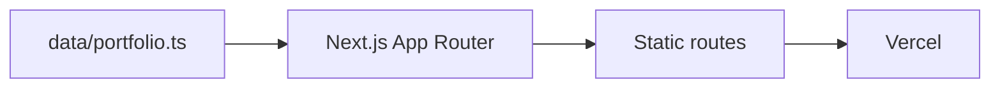

# Portfolio Website AI Guide

## Start Here

- This guide is a navigation and safety aid, not a knowledge archive.
- The wiki at vault-relative `Dev/Project/Personal/portfolio` owns product context, content decisions, roadmap, and history. Resolve the vault through `_meta/routing-tables.md` or `obsidian-wiki-sync`, never hardcoded file URLs.
- Before non-trivial work, read wiki `README.md` → `handoff.md` → `schema.md` → `index.md`; read `issues/needs-verification.md` when uncertainty is relevant.
- Before multi-step or resumed implementation, ground wiki context against live code, propose `step → verify` checkpoints, and confirm them before editing.
- Report to the user in Korean; keep code, identifiers, and commands in English.
- Handle small or single-area work directly. Use the optional KJW roles only when delegation materially reduces time or improves independent review.

## Product and Runtime/Pipeline Map



## Module/Domain Map and First Reads

| Area | Source entrypoint | Local guide | Wiki |
| --- | --- | --- | --- |
| Content and data | `data/portfolio.ts` | `data/AGENTS.md` | `content/content-model.md`, `content/career-hub-integration.md` |
| Main and detail UI | `app/page.tsx`, `app/projects/[id]/page.tsx` | `app/AGENTS.md` | `technical/code-structure.md` |
| Theme and fonts | `app/globals.css`, `app/layout.tsx` | `app/AGENTS.md` | `technical/code-structure.md` |
| Build and deployment | `package.json`, `next.config.ts` | root guide | `operations/deployment.md` |

Read only the nearest local guide for files you will change.

## Task Router

| Request | Wiki first | Source first | Verify |
| --- | --- | --- | --- |
| Project or career content | `content/content-model.md`, `content/career-hub-integration.md` | `data/portfolio.ts` | data guide, static build |
| Main or detail UI | `technical/code-structure.md` | `app/page.tsx`, `app/projects/[id]/page.tsx` | app guide, relevant route |
| Theme, font, or CSS | `technical/code-structure.md` | `app/globals.css` | responsive and accessible rendering |
| User-provided material | repository `inputs/README.md`, then only the requested input path | the task-relevant app or data entrypoint | direct work or one useful specialist |
| Build or deployment | `operations/deployment.md` | `package.json`, `next.config.ts` | lint and production build |

## Immutable Boundaries and Change Gates

- Career claims come from `Career-Hub`; do not invent metrics, contribution levels, or disclosure scope. Put uncertainty in wiki `issues/needs-verification.md`.
- Keep portfolio content in `data/portfolio.ts`, not hardcoded across UI components.
- Preserve static generation for every `app/projects/[id]` route and keep TypeScript and lint clean.
- Preserve the current five-project order: UBio-N Face Pro → Fisher Lotto → SmartSet Renewal → SmartSet → Anti-Spoofing AI.
- Preserve root, `app`, and `data` guides; update them surgically when their owned paths or gates change.
- Do not mix unrelated refactors into a requested change.

## Build and Verification

Run the narrowest checks that cover the change.

```powershell
# Dependency changes only
npm.cmd install

# Normal code/content verification
npm.cmd run lint
npm.cmd run build

# Manual route or interaction verification
npm.cmd run dev
```

Use `npm run ...` outside Windows. Confirm the affected route manually when the task changes layout, interaction, or responsive behavior.

## Optional KJW Team Orchestration

- Direct work: questions, documents, configuration, or one small code area. Do not announce a workflow classification or load role files.
- Medium work: delegate to at most one relevant role when it provides a distinct result.
- Large work: delegate independent areas to two or three roles; keep shared files sequential.
- Triple Crown: use only when the user asks for it or the work is a genuine multi-phase service or architecture effort.
- If subagents are unavailable, work directly without ceremony.

Read `roles/eungwang.md` only when delegation is warranted, then load only the selected role files:

| Role | File | Use for |
| --- | --- | --- |
| 민혁, architect | `roles/minhyuk.md` | Architecture and task decomposition |
| 창섭, developer | `roles/changseop.md` | Implementation and dependencies |
| 현식, UI/UX | `roles/hyunsik.md` | Layout, interaction, and visual system |
| 프니엘, researcher | `roles/phaniel.md` | External evidence and comparisons |
| 성재, QA/reviewer | `roles/seongjae.md` | Independent review and verification |

For delegated work, state the allowed and forbidden paths, keep shared files assigned to one worker at a time, and review every result before integration. Run wiki synchronization at session end; do not force a full build when only guides or wiki documents changed.
